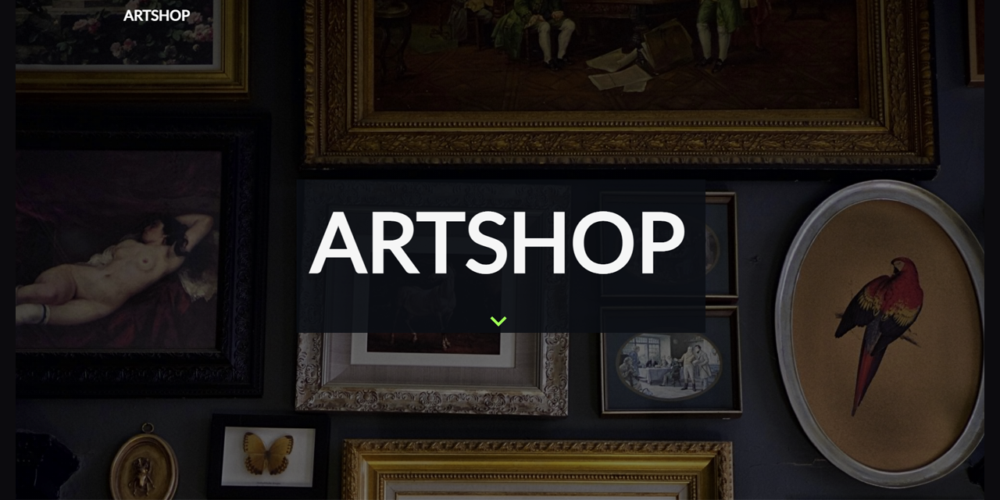

# Artshop-TTP-Capstone

Live link to the ARTSHOP :point_right: https://ttp-art-shop.netlify.app/ :point_left:

* Created an e-commerce store in a team of 4 where users can buy and sell art in different categories
* Developed the user interface using React.js and Material-UI components
* Integrated content management system Strapi to upload artwork and register artists
* Set up an agile Trello board with lists for backlogged, currently worked on, and completed items to keep track of the project’s progress and assign tasks to team members

