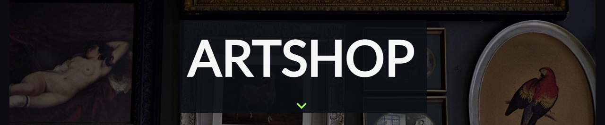

<!-------------------------------------------------------------------------------------------------------------------------->

# Artshop-TTP-Capstone

A Full-stack project developed during the NYC Tech Talent Pipeline Program.  
E-commerce store where users can buy and sell art in different categories.

<!-------------------------------------------------------------------------------------------------------------------------->

## Table of Contents

* [Installation and Setup](#install)
* [Live Project Link](#live)
* [Technology Used](#tech)
* [Team Members](#team)

<!-------------------------------------------------------------------------------------------------------------------------->

##  Installation and Setup

Clone down this repository into your local machine 

> You will need `node` and `npm` installed globally on your machine.  
> Navigate to https://nodejs.org/en/download/ and make sure to download the “LTS” version.

Installation:

`npm install`

To Start Server:

`npm start`

To Visit App:

`localhost:3000`

<!-------------------------------------------------------------------------------------------------------------------------->

##  Live Project Link

Application is deployed on :point_right: https://ttp-art-shop.netlify.app/ :point_left: using Netlify 

<!-------------------------------------------------------------------------------------------------------------------------->

##  Technology Used

#### Frontend:

#### Backend:

#### Deployment:

#### Additional:

<!-------------------------------------------------------------------------------------------------------------------------->

##  Team Members
 * [Smilte Valasinaite](https://www.linkedin.com/in/smiltevalasinaite/)
 * [Joseph LaMantia](https://www.linkedin.com/in/lamantiajoseph/)
 * [Sabahet Alovic](https://www.linkedin.com/in/sabahet/)
 * [Vincenzo Mezzio](https://www.linkedin.com/in/vincenzomezzio/)
